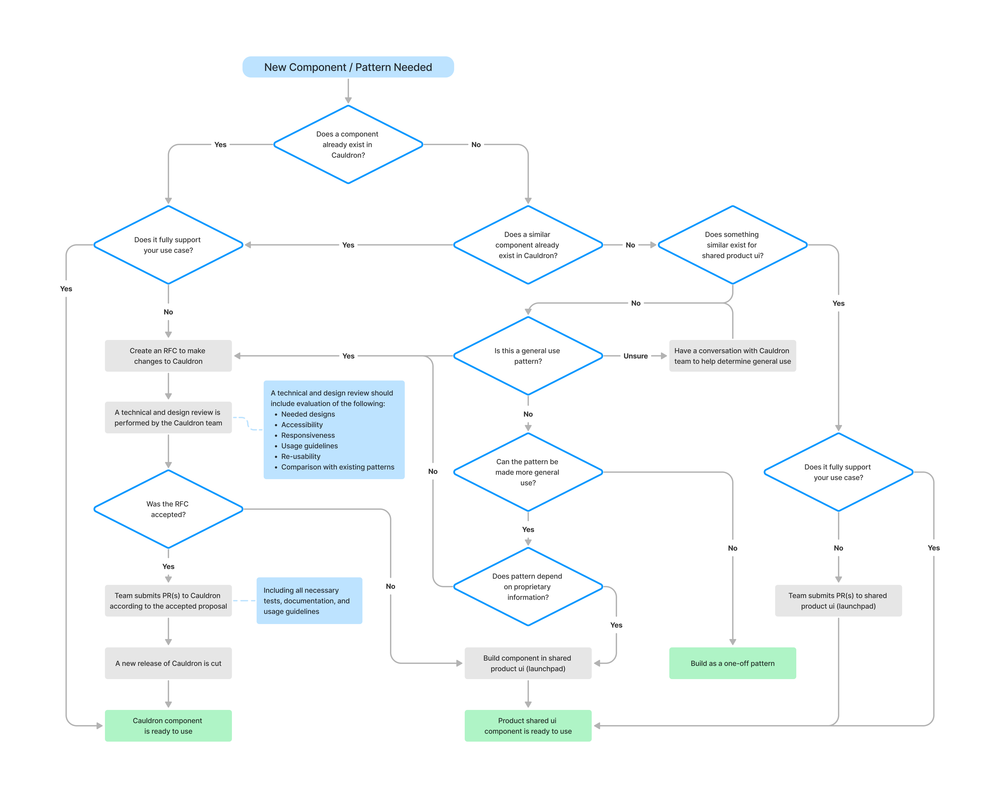

# Contributing

1. [Getting Started](#getting-started)
   - [Discussing Proprietary Features](#discussing-proprietary-features)
   - [Setup](#setup)
1. [Adding New Components](#adding-new-components)
   - [Process for New Components](#process-for-new-components)
1. [Developing Components](#developing-components)
   - [Tools Used](#tools-used)
   - [Structure](#structure)
   - [Quality Checklist](#quality-checklist)
   - [Server-side Rendering Compatibility](#server-side-rendering-compatibility)
   - [Linting](#linting)
   - [Icons](#icons)
   - [Commit Messages](#commit-messages)
   - [Pull Requests](#pull-requests)
   - [Testing Strategies](#testing-strategies)
   - [Unit Tests](#unit-tests)
   - [Accessibility Testing](#accessibility-testing)
1. [Documentation](#documentation)
1. [Breaking Changes](#breaking-changes)
   - [Components](#components)
   - [Styles](#styles)
   - [Deprecating](#deprecating)
   - [Removal](#removal)

## Getting Started

Cauldron is Deque's design system / pattern library for building accessible ui as part of our products as Deque. Cauldron consists of several parts, [react](./packages/react), [styles](./packages/styles), and [documentation](./docs).

As Cauldron is first and foremost a design system for building products at Deque, this means we won't necessarily have 1:1 parity with other design systems. Patterns that don't exist in Deque product UI won't be added as a component within the design system.

### Discussing proprietary features

This is a public repo, so care needs to be taken to not include details or screenshots for unannounced or unreleased features in Deque products. Any issues or pull requests need to describe work without including specific business logic or feature details directly related to Deque products. If context is necessary to implement a specific Cauldron feature, please open an issue in the private [cauldron-team repo](https://github.com/dequelabs/cauldron-team/issues) and link to it via the issue or pull request.

### Setup

Local development setup is documented in [this project's readme](./README.md#development)

## Adding New Components

One of Cauldron's primary goals is to provide high quality, stable, reusable components. This process is intentionally slow because it is a critical front-end infrastructure of Deque's products.

As such, components that land in Cauldron tend to have several, if not all of the following qualities:

- Likely to be used more than once
- Solves a single problem particularly well
- Provides a similar interface to established Cauldron components
- Does not rely on product specific dependencies or patterns
- Does not contain side effects (like data fetching)
- A single pattern that is replacing multiple existing patterns within products
- Upstreaming an existing common shared pattern that exists in products

There is a natural friction between the speed at which Cauldron moves as a design system, and how products need to quickly iterate and release new features. We want to strike a balance between avoiding "junk" in our design system, but still allowing for Deque products to develop without Cauldron being a bottleneck.

### Process for New Components

For a new component to be added to Cauldron, the below workflow describes the desired process for a new Component:

<details>
   <summary>Workflow chart describing process and steps to getting a component added to Cauldron</summary>



</details>

<details>
  <summary>Long description for the above flow chart</summary>
  
1. Does a component already exist in Cauldron? If yes, go to 2. If no, go to 3.
2. Does it fully support your use case? If yes, the component is ready to use. If no, continue:
    - Create an RFC to make changes to Cauldron
    - A technical and design review is performed by the Cauldron team
    - Continue to 6.
3. Does a similar component already exist in Cauldron? If yes, go to 2. If no, go to 4.
4. Does something similar exist for shared product ui? If yes, go to 8. If no, go to 5.
5. Is this a general use pattern? If yes, complete steps under 2. If no, go to 7. If you're unsure, have a conversation with the Cauldron team to help determine general use and repeat this step.
6. Was the RFC accepted? If no, build component in shared product ui. If yes, continue:
    - Team submits PR(s) to Cauldron according to the accepted proposal
    - A new release of Cauldron is cut
    - Component is ready to use
7. Can the pattern be made more general use? If yes, go to 9. If no, build the pattern as a one-off pattern.
8. Does it fully support your use case? If yes, use existing shared product ui component. If no, build component in shared product ui.
9. Does the pattern depend on proprietary information? If yes, build component in shared product ui (launchpad). If no, complete steps under 2.
</details>

## Developing Components

General [component guidelines](https://cauldron.dequelabs.com/component-guidelines) and [style guidelines](https://cauldron.dequelabs.com/style-guidelines) live within our documentation.

- Use well-structured semantic markup over `aria-*` attributes
- Don't specify units for zero values, e.g. `padding: 0px;`, instead you can omit the unit, e.g. `padding: 0;`
- Avoid using CSS prefixes (e.g. `-webkit` or `-moz`) unless absolutely necessary. [autoprefixer](https://github.com/postcss/autoprefixer) should automatically handle prefixes.

### Tools Used

- [React](https://react.dev/)
- [Typescript](https://www.typescriptlang.org/)
- [Webpack](https://webpack.js.org/)
- [Jest](https://jestjs.io/)
- [axe-core](https://github.com/dequelabs/axe-core)
- [React Testing Library](https://testing-library.com/docs/react-testing-library/intro/)
- [MDXJS](https://mdxjs.com/)
- [ESLint](https://eslint.org/)
- [Prettier](https://prettier.io/)
- [Puppeteer](https://pptr.dev/)

### Structure

```
├─ packages/react/src/components
│  └─ Combobox/
│     ├─ index.ts           # exports the component and subcomponents
│     ├─ Combobox.tsx       # main component file
│     ├─ ComboboxItem.tsx   # subcomponent file
│     └─ Combobox.test.tsx  # unit/behavior tests
└─ packages/react/styles
   ├─ index.css             # global styles export
   └─ combobox.css          # component styles
```

### Quality Checklist

Cauldron does not have a dedicated quality assurance (QA) individual. Having a full-time dedicated QA individual is a luxury most design systems do not have, ours included. In order to deliver components with high quality it is expected that everyone participating as a part of a component's development lifecycle wear different hats to help ensure we meet that high level of quality. Both an individual developing a component and a reviewer reviewing a component are accountable for considering the following checklist:

- Does the component follow general [component guidelines](https://cauldron.dequelabs.com/component-guidelines)?
- Does the component follow general [style guidelines](https://cauldron.dequelabs.com/style-guidelines)?
- Does the component cover all of the necessary variations within scope? (i.e. default, primary, secondary)
- Does the component cover all of the necessary interactive states? (i.e. active, focus, expanded, disabled)
- Does the component account for different layouts within different viewports? (i.e. responsiveness, media queries, overflow)
- Does the component API match the current design patterns of components? (i.e. props, events, callbacks)
- Does the component only implement features that fall within our browser support or implement these features via progressive enhancement?
- Does the component support both light and dark themes?
- Does the component have appropriate documentation?
- Does the component support customizing text labels or content for translations?
- Does the component need usability testing?
- Does the component have documented dos and don'ts?

### Server-side Rendering Compatibility

Every Cauldron component needs to be compatible with server-side rendering (SSR). A component should be able to render in an SSR environment such as [Gatsby.js](https://www.gatsbyjs.com/) or [Next.js](https://nextjs.org/) while avoiding DOM globals like `document` or `window` that are not available in these environments.

Cauldron uses [`eslint-plugin-ssr-friendly`](https://github.com/kopiro/eslint-plugin-ssr-friendly) to help prevent the accidental misuse of DOM globals. An additional [utility](./packages/react/src/utils/is-browser.ts) is available to help guard against using DOM globals:

```tsx
import { isBrowser } from '../../utils/is-browser';
export default function SomeComponent() {
  if (!isBrowser()) {
    return null;
  }
  // do browser/DOM things
}
```

### Linting

The files in this project are formatted by Prettier and linted with ESLint. Both are run when code is committed (as a pre-commit hook).

#### Running Lint Manually

| Command           | Description                             |
| :---------------- | :-------------------------------------- |
| `yarn lint`       | Runs eslint against everything          |
| `yarn lint --fix` | Automatically fixes some linting errors |

### Icons

Icons are located in [packages/react/src/components/Icon/icons](./packages/react/src/components/Icon/icons). To add a new icon, follow the following steps:

- Change any `fill`, `stroke`, or any color related attributes in the SVG to use `currentColor`.
- Remove any namespace attributes (such as `xmlns:*`) from the SVG.
- Save your icon in the above location with the proposed name of your icon, e.g. `[your-name].svg`. The `your-name` portion will be how the icon is used in the React Component, e.g. `<Icon type="your-name" />`.

### Commit Messages

Cauldron follows the [conventional commit specification](https://www.conventionalcommits.org/en/v1.0.0/#summary) and is enforced via [semantic-pr-title](https://github.com/dequelabs/semantic-pr-title). When submitting a pull request, please ensure your initial commit message or pull request title follows the spec.

#### Change Types

Cauldron aims to avoid shipping [breaking changes](#breaking-changes) on a regular basis, instead opting to use `fix` or `feat` for a majority of changes mapping to `patch` and `minor` semver bumps respectively. The following changes below map to their corresponding semver bumps:

| Category             | Type of Change                                                        | Semver             |
| :------------------- | :-------------------------------------------------------------------- | :----------------- |
| Components           | A component is added                                                  | `minor`            |
|                      | A component is deprecated                                             | `minor`            |
|                      | A component is removed                                                | `major` (breaking) |
|                      | A change is made that does not affect the public API of the component | `patch`            |
| Component Props      | An optional prop is added                                             | `minor`            |
|                      | A required prop is added                                              | `major` (breaking) |
|                      | A prop's type is expanded                                             | `minor`            |
|                      | A prop's type is narrowed                                             | `major` (breaking) |
|                      | A prop is deprecated                                                  | `minor`            |
|                      | A prop is removed                                                     | `major` (breaking) |
| Component Styles/CSS | Adding a new css selector                                             | `minor`            |
|                      | Removing a css selector                                               | `major` (breaking) |
|                      | Adding a css variable                                                 | `minor`            |
|                      | Removing a css variable                                               | `major` (breaking) |
|                      | Modifying css properties                                              | `patch` or `minor` |

### Pull Requests

We aim to review pull requests within a day or two. If your changes are time-sensitive, feel free to request an expedited review on GitHub or reach out in the private `#cauldron` slack channel.

New components that have visual components or PRs that include visual changes to [component snapshot testing screenshots](https://github.com/dequelabs/cauldron/blob/develop/e2e/readme.md#snapshot-testing) should have an approval from [@dequelabs/design-team](https://github.com/orgs/dequelabs/teams/design-team).

Once approved by a member of the Cauldron team, your pull request can be merged at any time but _must_ be squash merged.

#### Previewing Changes

Cauldron documentation is deployed automatically via [amplify web previews for pull requests](https://docs.aws.amazon.com/amplify/latest/userguide/pr-previews.html) with each commit to a PR. To view the preview of your changes, navigate to your PR and find the comment from the `aws-amplify` bot, which will include a link to the preview site for that PR. The preview site will only persist for as long as the PR remains opened and will be deleted when closed.

### Testing Strategies

The testing methodology should account for both testing the interface of a component as input/output testing and how an end-user would interact with the component. Ideally, implementation details are avoided unless necessary. Examples below of things to consider when writing tests for a component:

- Including all variants in tests (i.e. default, primary, secondary)
- Including different interactive states (i.e. focus, expanded, disabled)
- Including testing different behaviors for functionality related to different layouts (i.e. responsiveness, media queries, overflow)
- Component api and events (i.e. callbacks, click / keyboard events)
- Running axe against various variants and states

### Unit Tests

Cauldron uses [Jest](https://jestjs.io/) as its test runner to run unit tests along with [React Testing Library](https://testing-library.com/docs/react-testing-library/intro/).

### Accessibility Testing

#### Ensuring component returns no violations (in unit test)

We use [jest-axe](https://www.npmjs.com/package/jest-axe) to run axe in our unit tests. It is expected that you run axe in **all states** of your component.

```jsx
test('should return no axe violations', async () => {
  render(<SomeCauldronComponent ref={ref} />);
  const component = screen.getByRole('button');
  expect(await axe(component)).toHaveNoViolations();
});
```

#### Running Tests

| Command                   | Description                                        |
| :------------------------ | :------------------------------------------------- |
| `yarn test`               | Runs all unit tests                                |
| `yarn test ComponentName` | Runs tests matching component name                 |
| `yarn test:a11y`          | Runs e2e accessibility tests against documentation |

## Documentation

Component documentation guidelines are outlined in [docs/readme.md](./docs/readme.md).

## Breaking Changes

Cauldron is constantly evolving, and it's inevitable that breaking changes will need to be introduced. Before a breaking change is released, other alternatives should be considered and allow for a deprecation period before the breaking change is released.

### Components

For cauldron's component library, any of the following would be considered breaking changes:

- Renaming (exported name) or removing a Component
- Changing a prop that would break usage of an existing component
- Adding a new required prop to an existing component

Some examples of implementing non-breaking changes for components:

#### Aliasing component name in export, supporting both component names

```js
export { NewName, OldName: NewName }
```

#### Aliasing a component prop, supporting both property names

```js
function Component({ oldProp: newProp, newProp }) { ... }
```

### Styles

For cauldron's styles library, any of the following would be considered breaking changes:

- Changing or removing a class name
- Changing or removing a global css custom property name (see `variables.css`)
- Changing or removing a component css custom property name

Some examples of implementing non-breaking changes for styles:

#### Aliasing CSS class, supporting both class names

```css
/* Usage of .Foo is deprecated, please use .Bar */
.Foo,
.Bar {
  ...;
}
```

#### Utilizing new css custom variable for new property name

```css
/* Usage of --red is deprecated, please use --better-red */
--red: var(--better-red);
--better-red: red;
```

In addition, changing a css custom property may be a breaking change for the following:

- Changing a global css custom property value (see `variables.css`)
- Changing a component css custom property value

For the latter, the change must be reviewed by a member of the cauldron team to ensure there are no breaking changes.

### Deprecating

Before a breaking change can be released, the breaking change should be documented with the component, property, or style being changed getting flagged as _Deprecated_. This could mean warning the consumer that a component or property is now deprecated, or including a deprecated comment next to a css class name. This deprecation must exist for at least two months. If a change is additive (e.g. making a new property required), the new property must be optional until the deprecation period has passed.

### Removal

Once the deprecation period has passed, the breaking change can be implemented by removing the deprecation and including `BREAKING CHANGE:` in the body of your commit message with the description of the breaking change.
